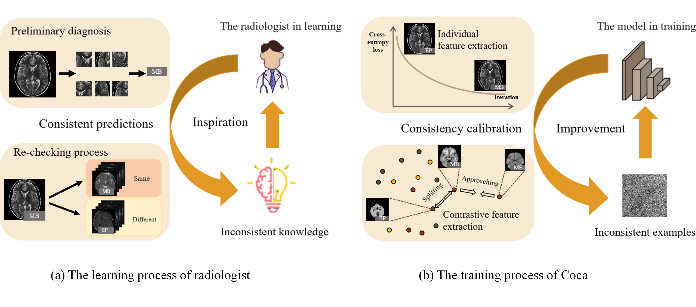

<!--
 * @Author             : ChenghaoSun (chsun@mail.ustc.edu.cn)
 * @Date               : 2022-01-03 09:27
 * @Last Modified By   : ZhenHuang (hz13@mail.ustc.edu.cn)
 * @Last Modified Date : 2022-01-03 19:27
 * @Description        : Details of tumor recognition settings
 * -------- 
 * Copyright (c) 2022 Multimedia Group USTC. 
--> 

```markdown
# Expert-Level Diagnosis of Pediatric Brain Tumors via Consistency Calibration
```
  <!-- 如果有项目标志，将其链接放在这里 -->


Accurate diagnosis of pediatric brain tumors (PBT) is critical for saving lives, but the limited number of specialists makes accurate diagnostics scarce. To make the diagnosis of PBT accurate, automatic, and noninvasive, researchers propose to employ deep neural networks (DNNs) to predict tumor types using magnetic resonance imaging (MRI) data. Advanced methods mainly focus on fine-tuning DNNs pre-trained on large-scale datasets of natural images, e.g., ImageNet. However, existing methods overlook the priors of human experts.In particular, human experts typically recheck, to ensure prediction consistency, whether images predicted as one class are similar to those predicted as the same class. Namely, the predicted results of an intelligent system should remain consistent. Inspired by the re-checking process, we propose a novel learning paradigm, called \emph{co}nsistency \emph{cal}ibration (Coca). 
Within the Coca framework, the output predicted by DNNs is guided by two objective functions: (i) the task-specific objective making the predicted results the same as the groundtruth, and (ii) an auxiliary objective re-checking the consistency of the prediction. To achieve Coca, we define the inconsistency for each sample by the inconsistent risks: the auxiliary risk is small (large), but the task-specific risk is large (small). Built upon the inconsistency definition, Coca identifies the inconsistencies for each sample in an adversarial attack manner. Subsequently, these inconsistencies are leveraged to tune DNNs in an adversarial training fashion for consistency calibration. To verify the efficacy of Coca, we conduct comprehensive experiments using a large-scale PBT dataset, showcasing that Coca can significantly outperform the state-of-the-art method. Moreover, Coca achieves a $3\%$ performance improvement over human experts, demonstrating the expert-level diagnostic performance in real-world PBT scenarios for the first time.


---

## Table of Contents

- [About](#about)
- [Installation](#installation)
- [Usage](#usage)
- [Training the Model](#training-the-model)
- [Contributing](#contributing)
- [License](#license)

---

## About

Provide a brief introduction to your project. Explain what it does, its main objectives, and why it's relevant or interesting. You can also mention any key features or technologies used.

---

## Installation

1. Clone the repository:

   ```bash
   git clone https://github.com/sunch-ustc/your-repo.git
   ```

2. Navigate to the project directory:

   ```bash
   cd coca
   ```

3. Create a Python virtual environment:

   ```bash
   python -m venv venv
   ```

4. Activate the virtual environment:

   On Windows:

   ```bash
   venv\Scripts\activate
   ```

   On macOS and Linux:

   ```bash
   source venv/bin/activate
   ```

5. Install project dependencies:

   ```bash
   pip install -r requirements.txt
   ```

---

## Usage

The method comprises two main steps: the instantiation of inconsistency and the consistency calibration. The visualization of the proposed method is shown in Figure.

---

## Training 

If your project involves training a model, provide instructions on how to do it. Include any relevant datasets, scripts, or parameters that need to be configured. For example:

1. Download the dataset from [Dataset Link](https://example.com/dataset).  Download the ResNet18 from [Model](https://download.pytorch.org/models/resnet18-5c106cde.pth)

2. Place the dataset files in the `data/` directory and  place the model files in the `model/` directory

3. Run the training script:

   ```python
   python coca.py       OUTPUT_DIR              "/output/"                    \
                        OUTPUT_RESULT           "/output/result.txt"          \
                        yaml_path               'config/default.yaml'         \
                        EVAL_CHECKPOINT         'model/resnet18-5c106cde.pth' \
                        DATA.DIR                'data/Internal.hdf5'          \
                        method                  'coca'                        \
                        TRAIN.BASE_LR           1e-4                          \
                        TRAIN.PRE_LR            1.0                           \
                        TRAIN.EPOCHS            200                           \
                        beta12  0.1     beta21      0.1                       \
                        times   3       epsilon     0.025    lamda [1.0,1.0,1.0,1.0]  
   ```

## Testing  
You can evaluate the trained model on either the internal test set or the external test set. We offer a pre-trained model available at 'models/model_best.pth.tar,' or you have the option to train a new model from scratch.

   ```python
   # test on the Internal test set
   python coca.py       OUTPUT_DIR              "/output/coca"             \
                        OUTPUT_RESULT           "/output/coca/result.txt"  \
                        yaml_path               'config/default.yaml'      \
                        EVAL_CHECKPOINT         'model/model_best.pth.tar' \
                        DATA.DIR                'data/Internal.hdf5'       \
                        Test                    "internal"
   ```

   ```bash
   # test on the External test set
   python coca.py       OUTPUT_DIR              "/output/coca"             \
                        OUTPUT_RESULT           "/output/coca/result.txt"  \
                        yaml_path               'config/default.yaml'      \
                        EVAL_CHECKPOINT         'model/model_best.pth.tar' \
                        DATA.DIR                'data/External.hdf5'       \
                        Test                    "external"
   ```
---
## Contributing

The dataset is collected through collaborations with several institutions：

1. Yunwei OU, Yongji TIAN,  Wei LIU, Chunde Li, Zhenyu MA,  Beijing Tiantan Hospital,  Capital Medical University;

2. China Pediatric Neurosurgery Federation (CPNF), National Center for Neurological Disorders;   

3. Qing CHANG, Dept. of Neuropathology, Beijing Neurosurgical institute Beijing Tiantan Hospital, Capital Medical University Rong ZHANG, Huashan Hospital, Fudan University; Junping ZHANG,SanboBrain Hospital, Capital Medical University; 

4. Guangyu WANG, Qilu Shandong University; Jie ZHAO, Xiangya Children's Hospital of Hospital, Central South University; 

5. Jie GONG, Qilu Hospital of Shandong University and institute of Brain and Brain-lnspired Science; 

6. Ping LIANG, Children's Hospital of Chongqing Medical University; 

7. Xiaosheng HE,Xijing Hospital, Air Force Medical University;

---

## License

This project is licensed under the [License Name](LICENSE) - describe the license terms here.

---

Feel free to customize this template to fit your project's specific needs. Adding sections like "References," "Acknowledgments," and "Contact" can also be helpful, depending on your project.